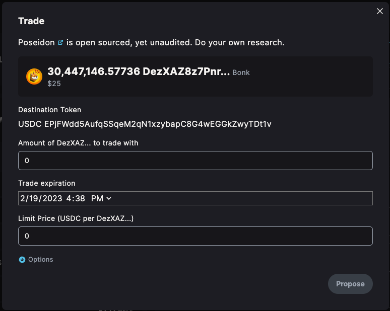

<div align="center">
  

  <h1>Poseidon</h1>
  <h2>Made with ❤️ by <a href="https://app.realms.today/dao/PSY">PSY DAO</a></h2>

  <p>
    <strong>Poseidon Repo</strong>
  </p>

  <h4>
    <a href="https://psyfi.io/">Website</a>
    <span> | </span>
    <a href="https://twitter.com/psyoptions">Twitter</a>
  </h4>
</div>

Access the entire liquidity of the Solana sea level runtime with Poseidon. Poseidon is a simple program that makes little assumptions of how a user would like to trade their assets.

The user simply states

1. What asset they want to trade and how much
2. What asset they want in exchange
3. The minimum execution price (i.e. limit price)
4. The time until these trade parameters expire

Then any can create and execute a trade `Route` on any venue across the Solana ecosystem! Poseidon ensures the trade executes for at least the limit price or it aborts the transaction. When trades execute, the assets are automatically deposited into the user's wallet.

Finally, if the expiration (`reclaim_date`) has passed, anyone can fire a transaction to return the un-traded assets to the original user's wallet.

## Program Deployments

| Program                      | Devnet                                        | Mainnet Beta                                  |
| ---------------------------- | --------------------------------------------- | --------------------------------------------- |
| [Remote](/programs/poseidon) | `oBRem4fksRF79j3wRkqMHdJfTzxbEEd73JgN3mFQjSK` | `oBRem4fksRF79j3wRkqMHdJfTzxbEEd73JgN3mFQjSK` |

## Development

This repo uses a proof of concept seeding mechanism to make your wallet the mint authority over the mainnet USDC address. Due to that, you must run the following script before running the tests.

1. `export ANCHOR_WALLET=$HOME/.config/solana/id.json`
2. First run the seed generator, which creates a USDC mint with your ANCHOR_WALLET key as the mintAuthority
   `ts-node tests/seeds/transformSeeds.ts`

### Running Tests

`anchor test`

## Poseidon Program

### Instruction Set

1. init_bounded_strategy_v2 : Create the `BoundedStrategyV2`
2. bounded_trade_v2 : Permissionless instruction for traders to execute any Route that meets the criteria of the initialized `BoundedStrategyV2`
3. reclaim_v2 : Permissionless instruction to return left over assets to the user that created the `BoundedStrategyV2`

### Account & Data Structures

```rust
#[account]
pub struct BoundedStrategyV2 {
    pub collateral_mint: Pubkey,
    /// The token account where the assets to be traded are held
    pub collateral_account: Pubkey,
    /// The date at which the DAO's assets can be reclaimed
    pub reclaim_date: i64,
    /// The address that the assets are transferred to when being reclaimed.
    pub reclaim_address: Pubkey,
    /// The address where the swapped asset should be deposited
    pub deposit_address: Pubkey,
    /// Using a numerator and denominator we can back out a price without having to use floating
    /// point math or account for token decimals when price checking.
    ///
    /// ### Example:
    /// Buying SOL with USDC for $92.75
    /// Use a numerator of 92_750_000 because USDC has 6 decimals. So 92_750_000 is 92.75 USDC.
    /// Use a denominator of 1_000_000_000 because SOL has 9 decimal places. So that's 1 SOL.
    /// 92.75 USDC / 1 SOL
    pub bounded_price_numerator: u64,
    pub bounded_price_denominator: u64,
    /// The bump for the strategy's derived address
    pub bump: u8,
}
```

## Governance UI integration



With a direct integration into the Solana Realms UI, any member of a DAO can propose to trade a treasury asset. The above image shows a DAO looking to trade their Bonk for USDC. To set this up with the Poseidon program the user must enter the following parameters:

**Destination Token**: The token the DAO wants in exchange for their current assets/

**Amount**: The amount of the source asset the DAO wants to trade with.

**Trade Expiration**: The time when Poseidon will block trade execution and allow assets to be returned to the DAO.

**Limit Price**: The minimum conversation price between the two assets.
