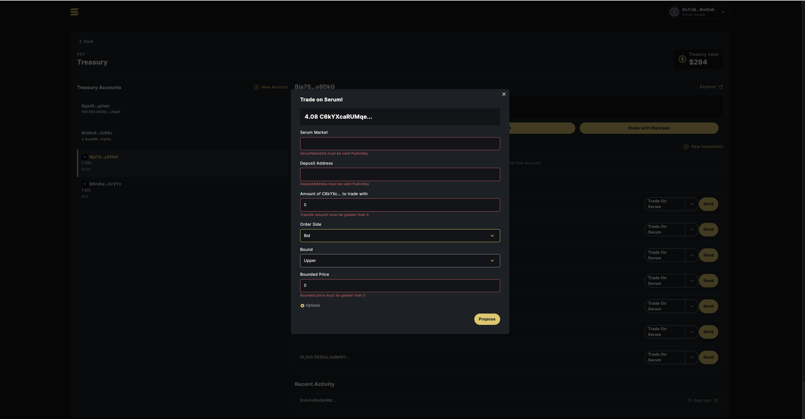

## Serum Execution Protocol

### Instruction Set

- InitBoundedStrategy
  - Create the appropriate Token accounts
  - Create and initialize the OpenOrders account owned by strategy
  - Transfer assets from the signer
  - Create and store the BoundedTrade account
  - Validate the BoundStrategy is not a LowerBounded Bid or an UpperBoundedAsk
  - Validate the order side & mint information aligns with the Serum market. This should also validate the mint for the deposit address against the market state as well.
    - E.g. if the DAO is trying to Buy SOL from the SOL/USDC market, the program should error if the mint is set to SOL
- BoundedTrade
  Allow DAOs to set an upper limit where the execution of the trade will only happen if an upper or lower bound is not crossed.
  - Validate the asset price on the order book is within the bounds
  - Execute the trade
  - Settle the funds to the deposit address
- ReclaimAssets
  Some strategies may have parameters that could never be met. I.e. a BuyMarket could have a manipulated order book and never actually execute a trade. The assets shouldn’t sit in this protocol, the DAO should be able to reclaim and put the assets to work elsewhere.
  - Validate that the current clock time is > the _reclaim_date_
  - Validate reclaim address is the same as the one stored on the strategy
  - Initiate token transfer from the token account from _order_payer_ to the _reclaim_address_
  - Close TokenAccount
  - Close OpenOrders account
  - Close Strategy account

### Account & Data Structures

```rust
struct BoundedStrategy {
	/// The PDA authority that owns the order_payer and open_orders account
	authority: Pubkey,
	/// The Serum market where the execution will take place
	seurm_market: Pubkey,
	/// The open_orders account that is owned by the authority and used to place orders
	open_orders: Pubkey,
	/// The SPL TokenAccount that contains the tokens that will be put into Serum for trading
	order_payer: Pubkey,
	/// The side of the order book the market order will be placed
	/// Bid or Ask
	order_side: Side,
	/// The date at which the DAO's assets can be reclaimed
	reclaim_date: i64,
	/// The address that the assets are transferred to when being reclaimed.
	reclaim_address: Pubkey,
	/// The address where the swapped asset should be deposited
	deposit_address: Pubkey,
  /// 0 for lower bound, 1 for upper bound
  bound: u8,
  /// The bound for the price in decimals equivalent to Serum Order book price
  bounded_price: u64
}
```

### Open Questions & Concerns

- Should the Strategy payer be stored on chain so when accounts are closed the SOL is reclaimed?
- Should the protocol ensure the deposit address has the same owner as the reclaim address?

## Governance UI integration



With a direct integration into the Solana Realms UI, any member of a DAO can propose to trade a treasury asset. Lets imagine the DAO holds token A and a member thinks the DAO should use it to buy or sell for another token, B. To set this up with the Serum Remote program the user must enter the following parameters:

**Serum Market**: The address of the Serum market that will be traded on. It should be a pair of A/B or B/A (Base Token / Quote Token).

**Deposit Address**: The DAO’s address that will receive the token B when trades successfully execute and settle.

**Amount of A to trade with**: The amount of token A to transfer to the Serum Remote protocol for the total buying/selling power or collateral

**Order Side**: If the market is A/B then the execution protocol must place _Ask_ or sell orders to sell token A for B. If the market is B/A then the execution protocol must play _Bid_ or buy orders to buy token B with token A.

**Bound**: If Order Side is \*Bid **\***then the bound must be set to Upper. The protocol takes into account the BoundPrice, so an upper bounded bid would translate to “Execute a bid for token B as long as the lowest ask is below the bound price”. When the Order Side is _Ask_ then the bound must be set to Lower. This would translate to “Execute an ask or sell A for token B as long as the highest bid is above the bound price”. Bids cannot be lower bound and asks cannot be upper bound.

**Bounded Price**: The price that governs the bound and is used to determine if the protocol should execute trades or not. (See **Bound** for more information).

**Reclaim Date**: The date that the strategy can be closed and any unused trading funds returned to the Reclaim Address (which is always set to the address the transferred the assets initially)
